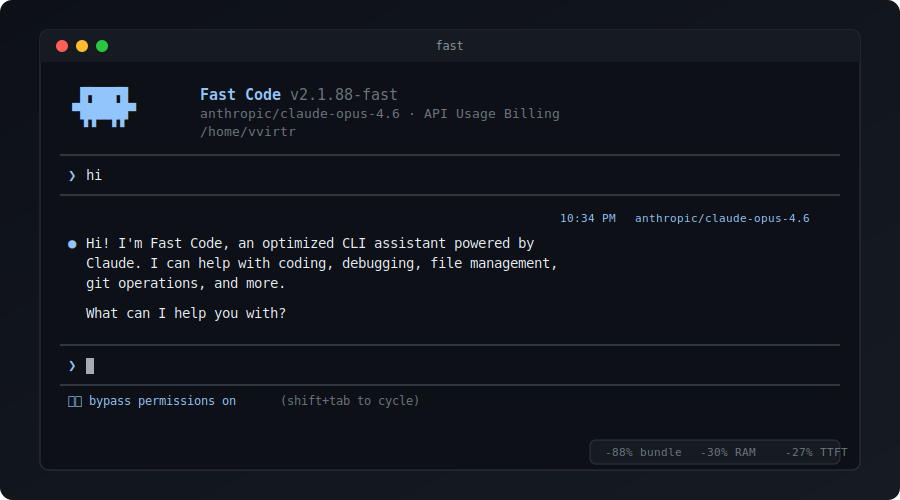

<h1> Fast Code</h1>

<p align="center">
  
</p>

Optimized fork of Claude Code 2.1.88. Same functionality, smaller bundle, lower memory footprint.

## Benchmarks

Linux, Bun 1.2, Opus 4.6.

| Metric | Claude Code | Fast Code | Delta |
|--------|------------|-----------|-------|
| Dist size | 64 MB | 7.6 MB | -88% |
| Peak RSS (short) | 224 MB | 158 MB | -30% |
| Peak RSS (real task) | 226 MB | 173 MB | -23% |
| TTFT `-p` | 6991 ms | 5135 ms | -27% |
| Page faults | 106k | 78k | -26% |
| CPU% (short) | 78% | 67% | -14% |

## Install

Requires [Bun](https://bun.sh).

```
git clone https://github.com/vvirtr/fast-code.git
cd fast-code
bun install
bash setup-stubs.sh
bun run build
sudo ln -sf "$(pwd)/fast" /usr/local/bin/fast
```

## Usage

```
fast                          # interactive
fast -p "your prompt"         # non-interactive
fast --model sonnet           # pick model
fast -c                       # continue last session
fast --version                # 2.1.88-fast (Fast Code)
```

Auth: set `ANTHROPIC_API_KEY` or run `fast auth login`.

## What changed

120+ modifications across ~200 files. Full list below.

### Build

- Bun bundler with minification and tree-shaking
- 88 feature flags inlined at build time for DCE
- highlight.js: 194 languages down to 20 (-990 KB)
- lodash-es fully replaced with native JS (20 functions, 103 files)
- Tiered imports plugin for deferred module loading
- ajv, plist, domino externalized
- @opentelemetry moved to optionalDependencies
- process.env.USER_TYPE inlined as "external" for ant-only DCE
- dist cleaned before each build

### Network and telemetry

- GrowthBook SDK stubbed entirely (356 call sites return defaults, no HTTP on startup)
- Telemetry init stripped
- Version check disabled
- MCP delta path forced on
- Session-memory compaction on by default

### Rendering

- colorize() caches 147 theme colors in a Map (was regex + chalk per call, 100-500x/frame)
- wrapText per-line cache, 4096 entries (eliminates re-wrapping unchanged lines)
- ANSI style persisted across frames (-35% SGR bytes)
- Yoga calculateLayout skipped when no node dirty
- StickyTracker Yoga reads cached between scroll ticks
- buildMessageLookups cached by array length (9 Maps + 2 Sets skipped)

### Tools

- Double Zod safeParse eliminated (parsed input threaded through)
- Permission check short-circuits before tree-sitter in bypass mode
- Bun.file().text() on hot read paths (5-10x vs fs.readFile)

### UI

- 13 notification/survey hooks removed
- Keybinding system: -1242 lines (chokidar, Zod schema, chord machine gone)
- Fuse.js autocomplete instance cached
- Image resize cached by content hash
- Skill bodies deferred to first use
- Ripgrep: Buffer[] accumulation, early-exit streaming

### I/O

- Config poll: 1s to 10s
- Session flush: 100 ms to 500 ms
- File cache: 100 to 200 entries
- LSP poll: 5s to 30s
- MCP stdio timeout: 30s to 10s
- OAuth: skip disk stat when token valid >10 min
- Git: 5s TTL cache, intermediate dir caching, removed user.name subprocess
- 10 cleanup registrations removed (diagnostic logs, auto-reclaimed fds)
- Session JSONL loading in Worker thread

### API

- SDK pretty-print stripped (re-serialize compact in fetch wrapper)
- Streaming watchdog: setTimeout per chunk replaced with setInterval + timestamp
- updateUsage same-reference return

### Style

- Pastel blue theme
- "Fast Code" branding
- Animations 20% faster
- Prompt line cleared on startup
- Alt-screen exit forced on shutdown

## License

Fork of proprietary Anthropic code. Research use only.
